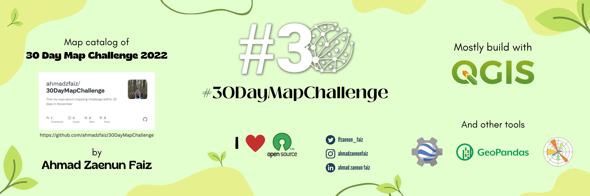
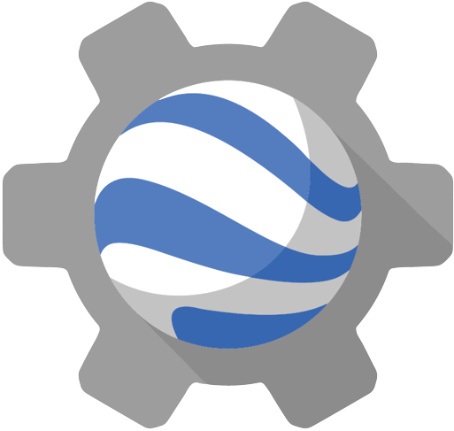

# #30DayMapChallenge 2022
#### by **_Ahmad Zaenun Faiz_**   

## MAP CATALOGUE  
###  <b>1. Day 1 - Points</b>
This is a map of cultural heritage locations around Prambanan Temple Compounds in Kewu Plain. Historically the area was identified as Mataram. The region was the center of the Medang i Bhumi Mataram kingdom in the 8th to 10th centuries. 
> .png)

### <b>2. Day 2 - Lines</b>
The majority of Indonesia's railways are on Java, used for both passenger and freight transport. Despite Indonesia having a left-hand running for roads, most of the railway lines use right-hand running due to Dutch influence. 
> .png)

### <b>3. Day 3 - Polygons</b>
Seruyan River is a river of Borneo, Indonesia. The river has its source near Bikit Tikung (1,175 metres) in the Schwaner Mountain Range. The river flow down on dense forest at Sembulu lakes and is said to be a major habitat of the orangutan.
> .png)

### <b>4. Day 4 - Colour Friday: Green</b>
NDVI is a simple graphical indicator that can be used to analyze remote sensing measurements, often from a space platform, assessing whether or not the target being observed contains live green vegetation.
> .png)

### <b>5. Day 5 - Ukraine</b>
Ukraine operates four nuclear power plants with 15 reactors located in Volhynia and South Ukraine. The total installed nuclear power capacity is over 13 GWe, ranking 7th in the world in 2020.
> .png)

### <b>6. Day 6 - Network</b>
Submarine communications cables are laid down by using specially modified ships (sometimes even purpose built ships) that carry the submarine cable on board and slowly lay it out on the seabed as per the plans given by the cable operator.
> .png)

### <b>7. Day 7 - Raster</b>
Kupang is the capital of the Indonesian province of East Nusa Tenggara. It had a population of 442,758 (2020). It's the largest city and port on the island of Timor, and is a part of the Timor Leste-Indonesia-Australia Growth Triangle FTZ.
> .png)

### <b>8. Day 8 - Data: OpenStreetMap</b>
Mandalika International Street Circuit is located in the Mandalika resort area on Lombok island, Indonesia. The sports cluster and entertainment project, measuring 120 hectares, is expected to include hotels and other facilities.
> .png)

### <b>9. Day 9 - Space</b>
Mars is the fourth planet from the Sun in the Solar System. Mars has surface features such as impact craters, valleys, dunes, and polar ice caps. It has a crust primarily composed of elements similar to Earth's crust.
> .png)

### <b>10. Day 10 - A bad map</b>
Blue colour is reserved for water features in a map. Never use blue for colouring land features or it will make the map readers confuse.
> .png)

### <b>11. Day 11 - Colour Friday: Red</b>
This is a Landsat 8 Imagery with 543 composite band. This imagery is suitable to monitor vegetation on earth surface. Red color mean vegetation existence in the specific location.
> .png)

### <b>12. Day 12 - Scale</b>
Map or cartographic scale is the ratio of a distance on Earth compared to the same distance on a map. Somewhat counterintuitively we describe detailed maps of smaller areas as large scale maps and global maps as small scale.
> .png)

* [Day 13 - 5 minute map]()
* [Day 14 - Hexagons]()
* [Day 15 - Food/drink]()
* [Day 16 - Minimal]()
* [Day 17 - A map without a computer]()
* [Day 18 - Colour Friday: Blue]()
* [Day 19 - Globe]()
* [Day 20 - "My favourite ..."]()
* [Day 21 - Data: Kontur Population Dataset]()
* [Day 22 - NULL]()
* [Day 23 - Movement]()
* [Day 24 - Fantasy]()
* [Day 25 - Colour Friday: 2 colours]()
* [Day 26 - Island(s)]()
* [Day 27 - Music]()
* [Day 28 - 3D]()
* [Day 29 - "Out of my comfort zone"]()
* [Day 30 - Remix]()

Tools used: 

