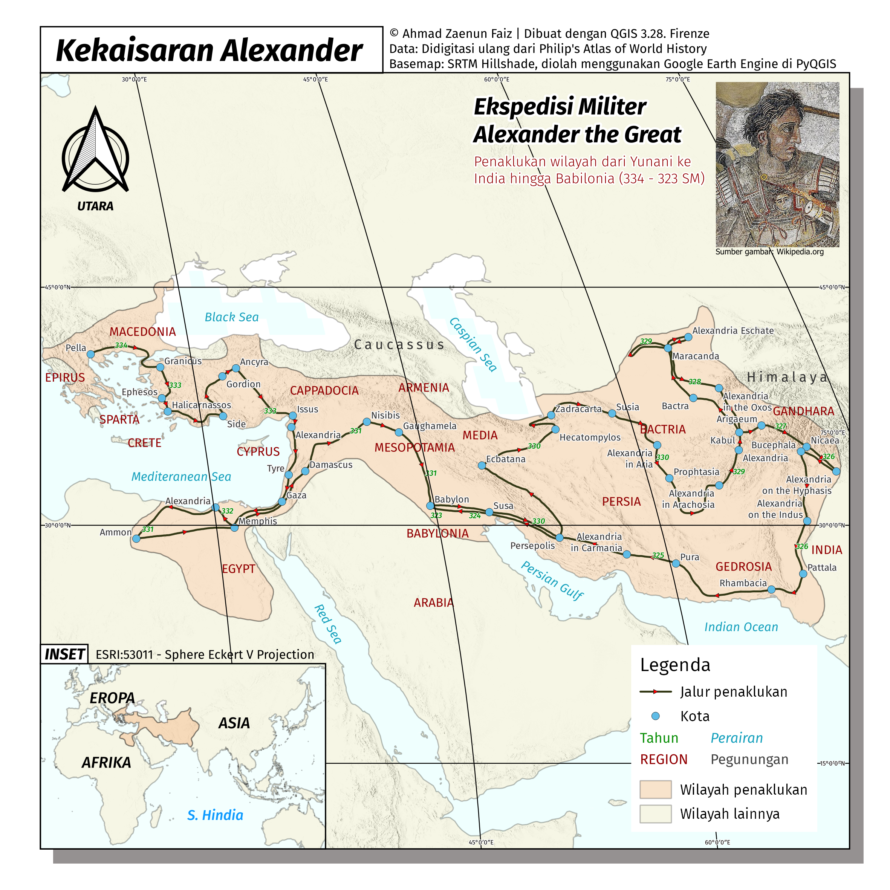
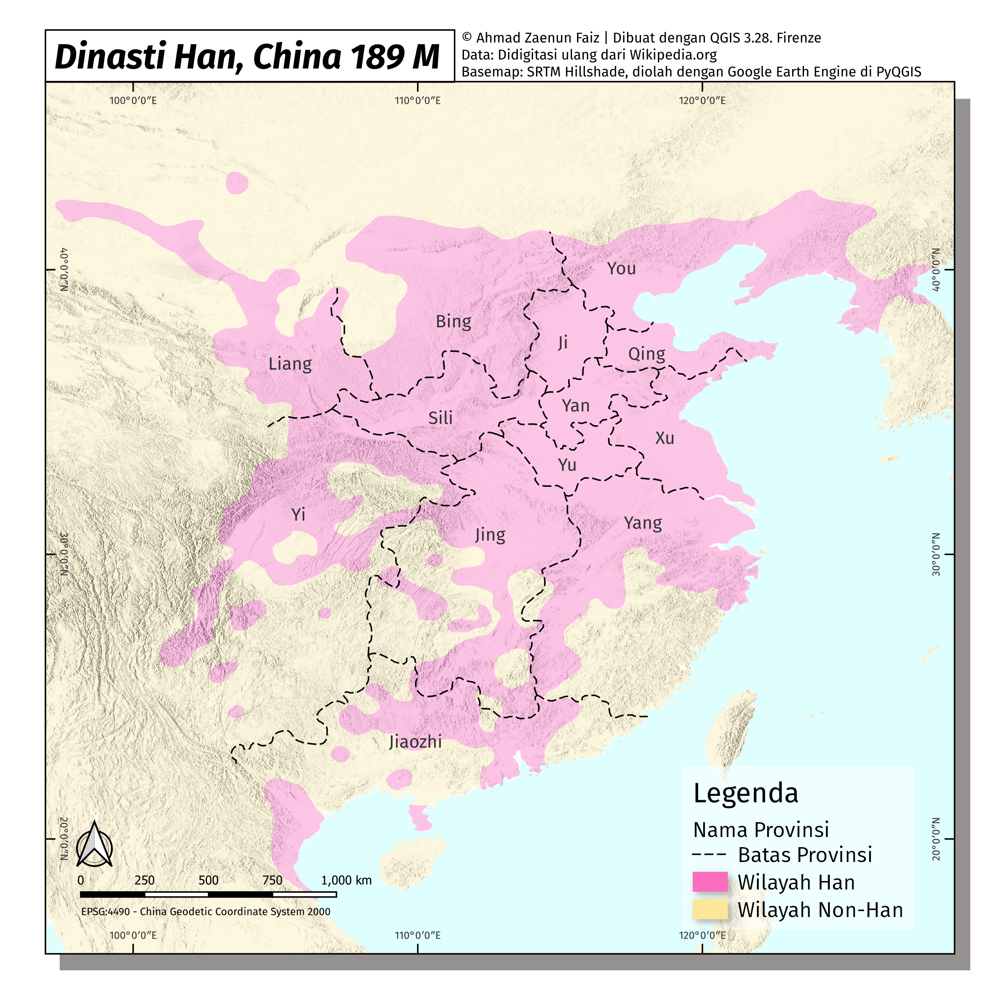
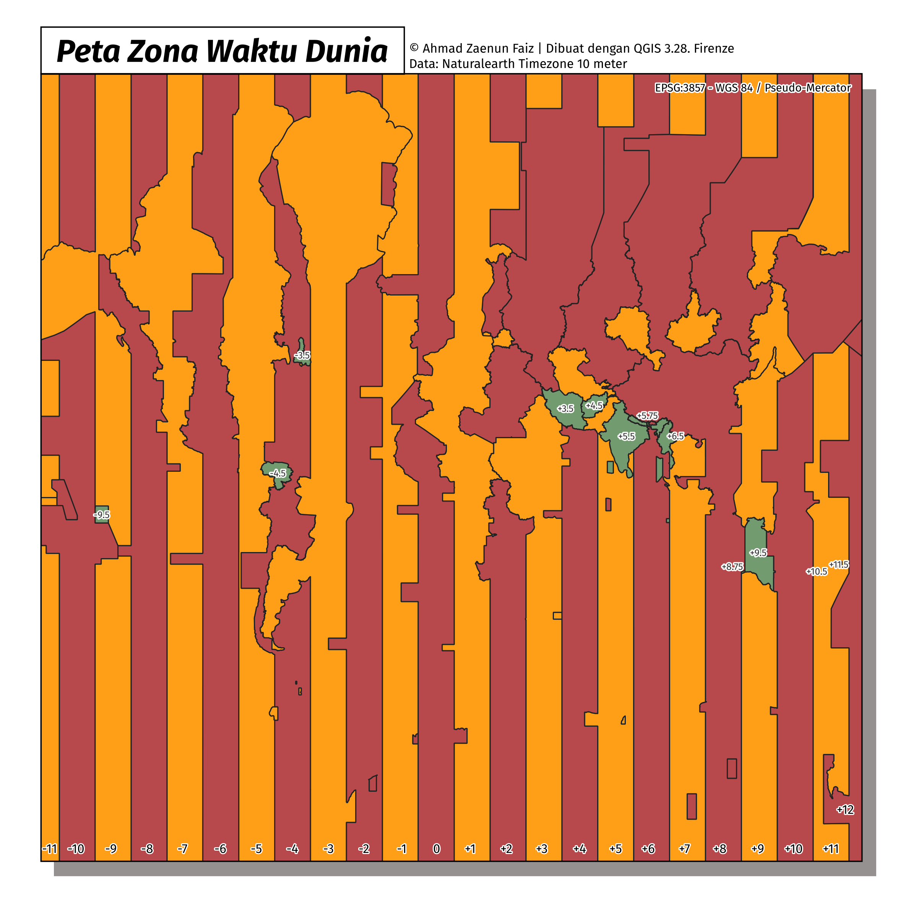
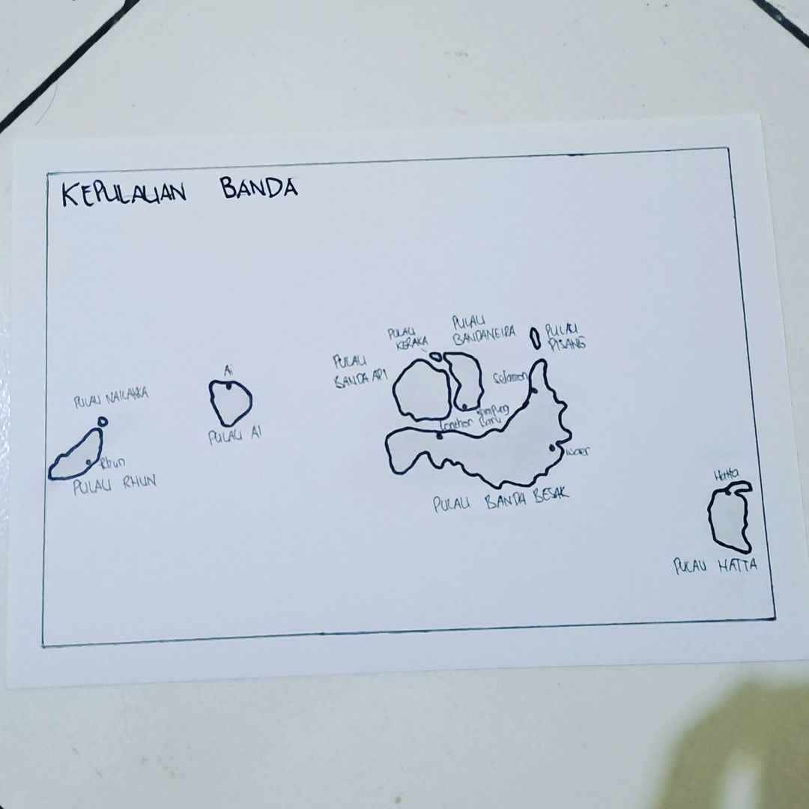
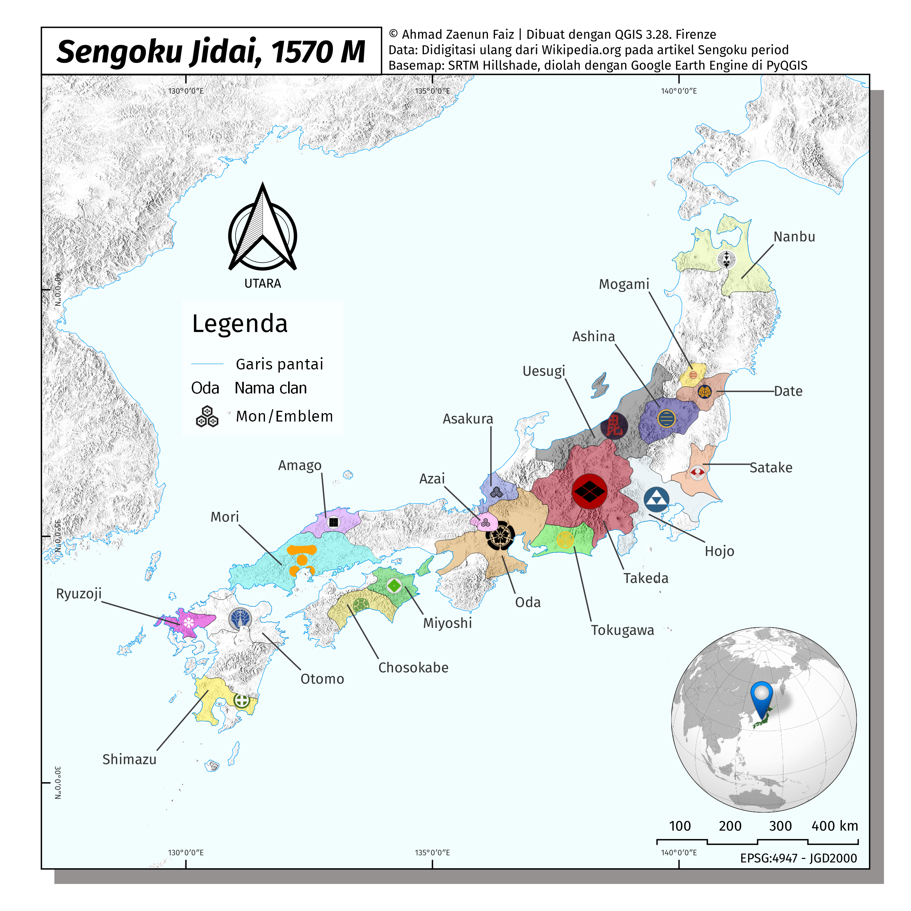
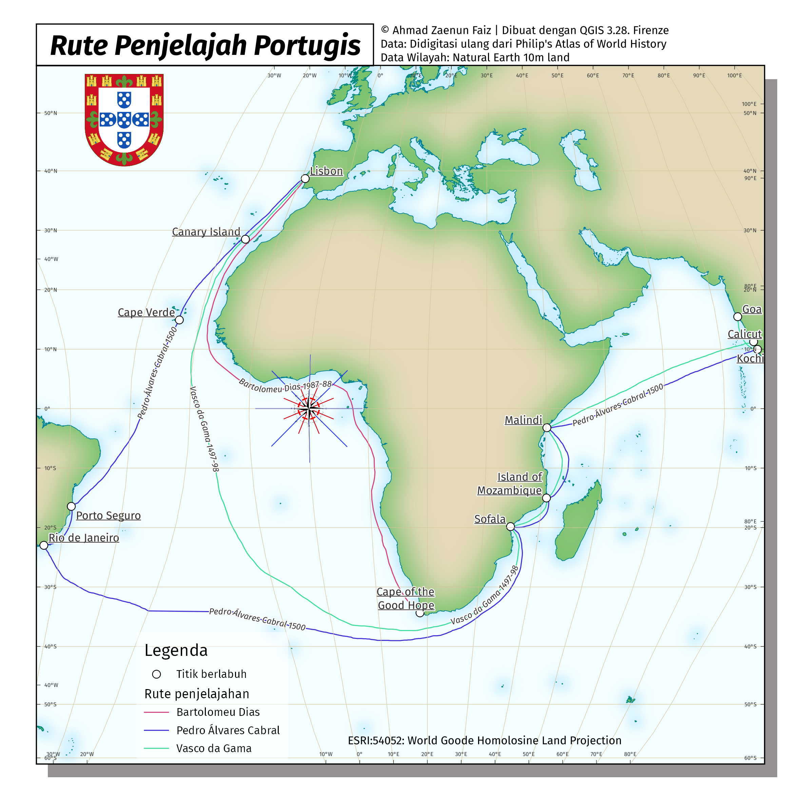
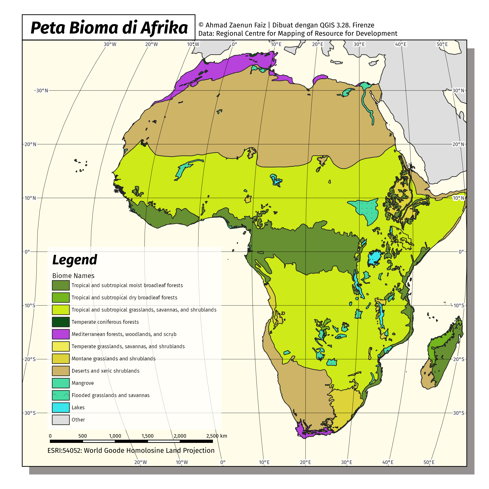
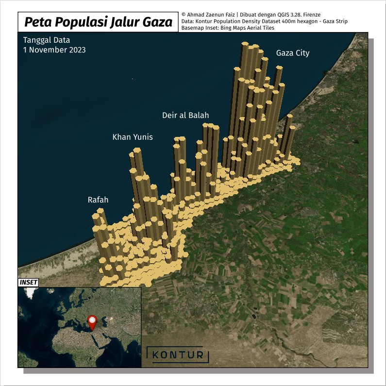
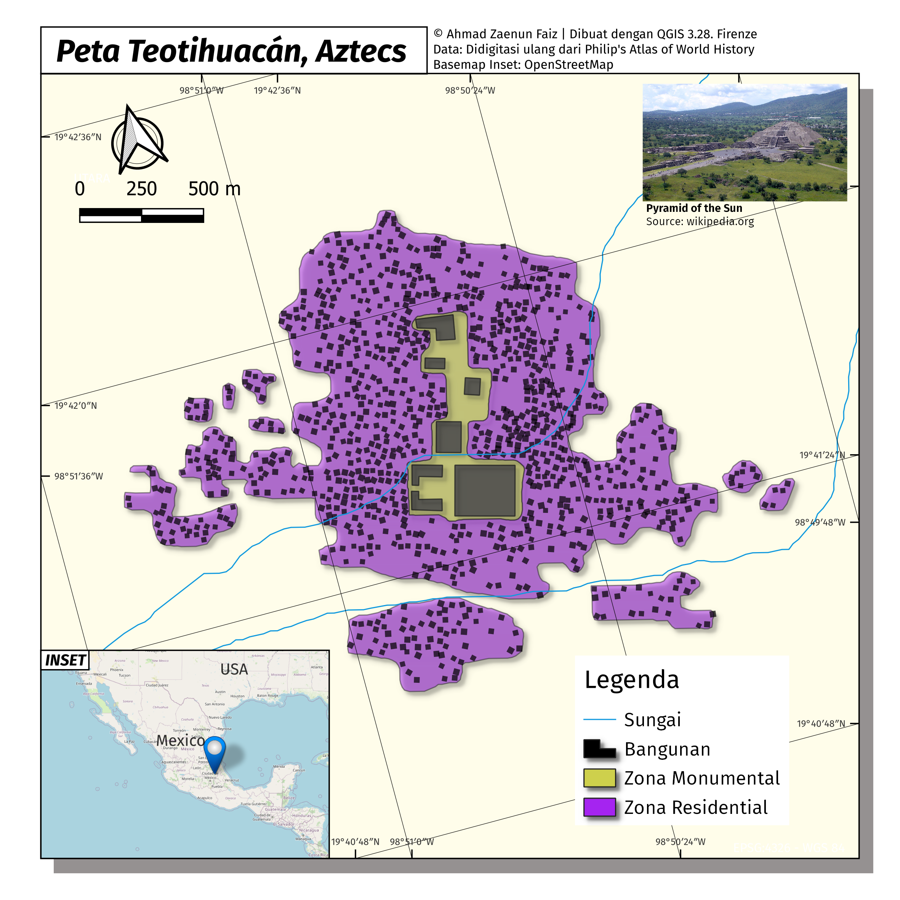
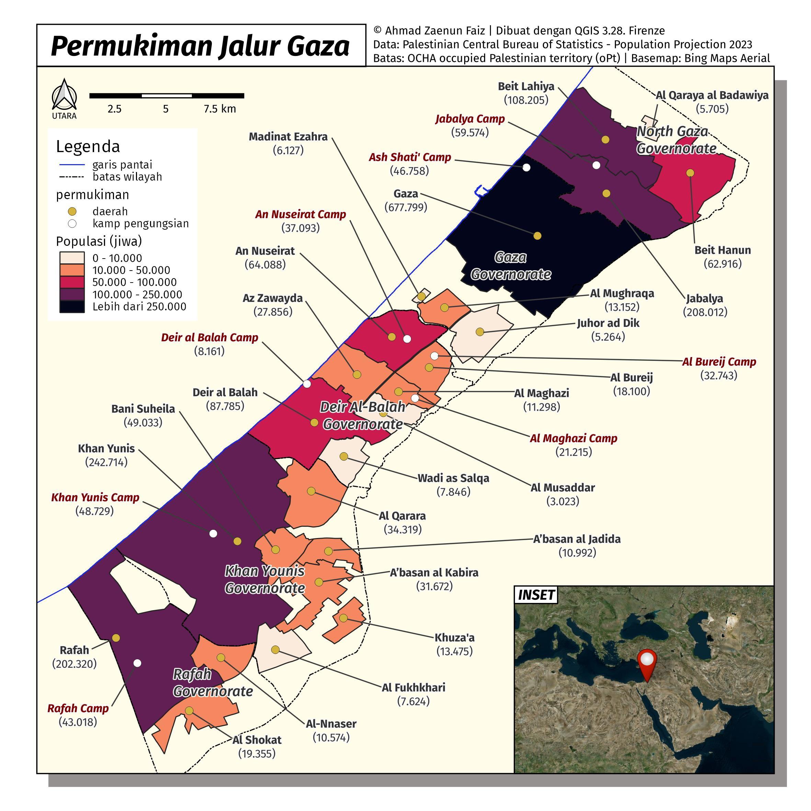

# #30DayMapChallenge 2023
by **_Ahmad Zaenun Faiz_**   

## MAP CATALOGUE  
###  <b>1. Day 1 - Points</b>
This map is showing the Mugiwara Pirate crew location while in Skypiea Arcade. Point is a useful representation of exact location, it could describe the location of each person in a map.
> 

### <b>2. Day 2 - Lines</b>
Alexander the Great was a king of the ancient Greek kingdom of Macedon. He succeeded his father Philip II to the throne in 336 BC at the age of 20, and spent most of his ruling years conducting a lengthy military campaign throughout Western Asia, Egypt and India. This map is showing military expedition route of Alexander.
> 

### <b>3. Day 3 - Polygons</b>
The Han dynasty was an imperial dynasty of China (202 BC – 9 AD, 25–220 AD), established by Liu Bang and ruled by the House of Liu. The dynasty was preceded by the short-lived Qin dynasty and it was succeeded by the Three Kingdoms period.
> 

### <b>4. Day 4 - A bad map</b>
World time zone map is so confusing. Its shape does not refer to longitude, but adapts to political territorial boundaries. Why is there such a confusing map like this?
> 

### <b>5. Day 5 - Analog Map</b>
The Banda Islands are a volcanic group of ten small volcanic islands in the Banda Sea. Until the mid-19th century the Banda Islands were the world's only source of the spices nutmeg and mace, produced from the nutmeg tree.
> 

### <b>6. Day 6 - Asia</b>
The Sengoku period is the period in Japanese history in which civil wars and social upheavals took place almost continuously in the 15th and 16th centuries. During this period, although the Emperor of Japan was officially the ruler of his nation and every lord swore loyalty to him, he was largely a marginalized, ceremonial, and religious figure who delegated power to the shōgun, a noble who was roughly equivalent to a general. In the years preceding this era, the shogunate gradually lost influence and control over the daimyōs (local lords).
> 

### <b>7. Day 7 - Navigation</b>
Portuguese maritime exploration resulted in the numerous territories and maritime routes recorded by the Portuguese as a result of their intensive maritime journeys during the 15th and 16th centuries. Portuguese sailors were at the vanguard of European exploration, chronicling and mapping the coasts of Africa and Asia, then known as the East Indies, and Canada and Brazil (the West Indies), in what came to be known as the Age of Discovery.
> 

### <b>8. Day 8 - Africa</b>
A biome is a biogeographical unit consisting of a biological community that has formed in response to the physical environment in which they are found and a shared regional climate. This map is showing biome distribution in the Africa continent.
> 

### <b>9. Day 9 - Hexagons</b>
In 2023, approximately 2.2 million people lived in the Gaza Strip, and almost 1.6 million of them were UN-registered refugees. Gaza strip is known as a dense populated area with population density 4,073 person/km sq.
> 

### <b>10. Day 10 - North America</b>
Teotihuacan is known today as the site of many of the most architecturally significant Mesoamerican pyramids built in the pre-Columbian Americas, namely the Pyramid of the Sun and the Pyramid of the Moon. At its zenith, perhaps in the first half of the first millennium (1 CE to 500 CE), Teotihuacan was the largest city in the Americas, considered as the first advanced civilization on the North American continent, with a population estimated at 125,000 or more, making it at least the sixth-largest city in the world during its epoch.
> 

### <b>11. Day 11 - Retro</b>
The Maluku Islands or the Moluccas are an archipelago in the eastern part of Indonesia. The islands were known as the Spice Islands because of the nutmeg, mace, and cloves that were exclusively found there, the presence of which sparked colonial interest from Europe in the 16th century.
> 

### <b>12. Day 12 - South America</b>
Guiana plains is known as fertile land in South America. The region is contested by colonial power such United Kingdom, Netherland, Spain and France for plantation establishment along the many rivers in the fertile Guiana plains. The boundary dispute in this map was inherited from the colonial powers between Venezuela (Spain 🇪🇸), Guyana (UK 🇬🇧), Suriname (Netherland 🇳🇱) and French Guiana (France 🇫🇷).
> 

### <b>13. Day 13 - Choropleth</b>
A choropleth map is a type of statistical thematic map that uses pseudocolor, meaning color corresponding with an aggregate summary of a geographic characteristic within spatial enumeration units. This is a choropleth map that showing population of Gaza Strip.
> 

### <b>14. Day 14 - Europe</b>
Coming soon...
> 

### <b>15. Day 15 - OpenStreetMap</b>
Coming soon...
> 

### <b>16. Day 16 - Oceania</b>
Coming soon...
> 

### <b>17. Day 17 - Flow</b>
Coming soon...
> 

### <b>18. Day 18 - Atmosphere</b>
Coming soon...
> 

### <b>19. Day 19 - 5 minute map</b>
Coming soon...
> 

### <b>20. Day 20 - Outdoors</b>
Coming soon...
> 

### <b>21. Day 21 - Raster</b>
Coming soon...
> 

### <b>22. Day 22 - North is not always up</b>
Coming soon...
> 

### <b>23. Day 23 - 3D</b>
Coming soon...
> 

### <b>24. Day 24 - Black & white</b>
Coming soon...
> 

### <b>25. Day 25 - Antarctica</b>
Coming soon...
> 

### <b>26. Day 26 - Minimal</b>
Coming soon...
> 

### <b>27. Day 27 - Dot</b>
Coming soon...
> 

### <b>28. Day 28 - Is this a chart or a map</b>
Coming soon...
> 

### <b>29. Day 29 - Population</b>
Coming soon...
> 

### <b>30. Day 30 - "My favourite.."</b>
Coming soon...
> 

Tools used: 

